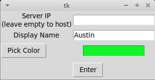
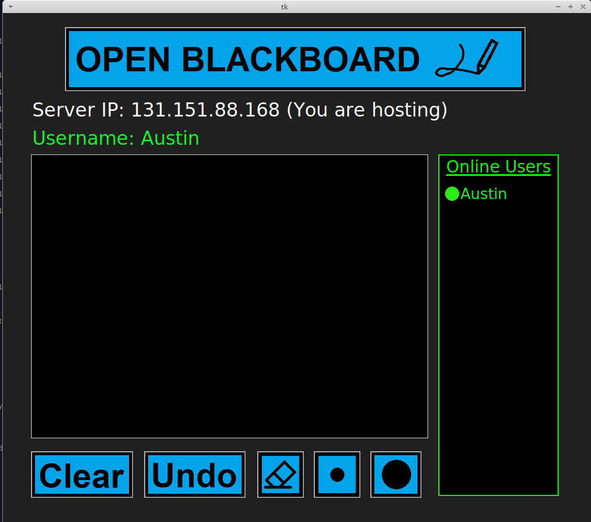
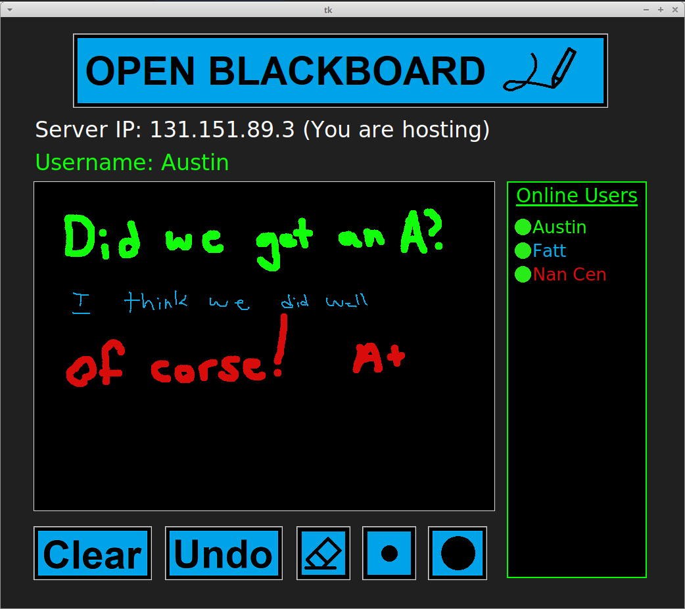
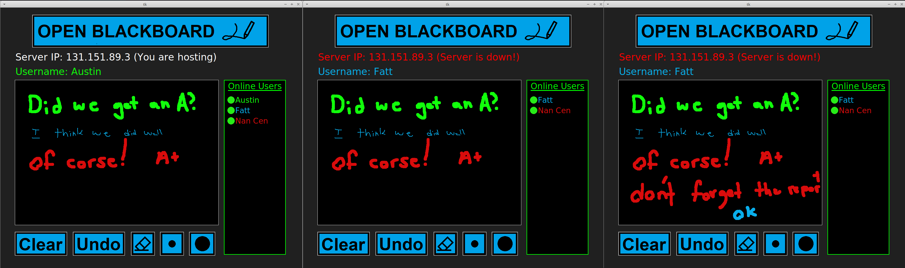
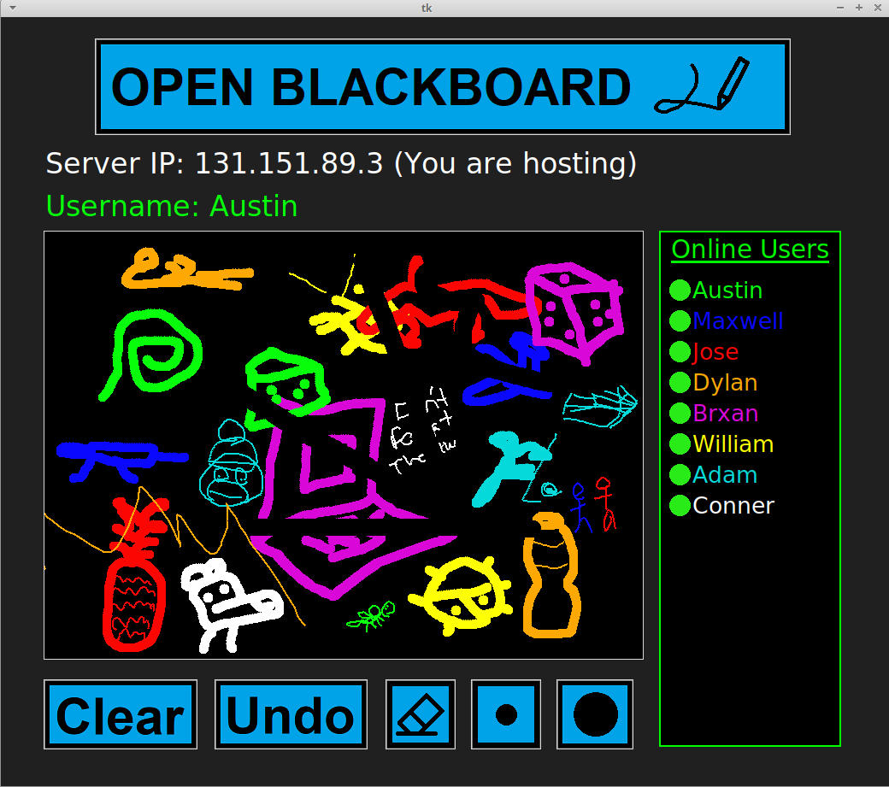

# P2P-OpenBlackboard
A P2P network used to send stroke data of a public blackboard

This was the group project for cs5600.  
By: Austin Pipkins and Fatt Hoe Yong

# Structure
The program operates in two phases, the first is a connection phase and the seconds being the P2P phase. The first phase prompts the user for three things. The first is the IP address of the hosting user/server. If the user wants to start their own blackboard room, they will leave this field blank. Next they are prompted to input a username; leaving this blank with result in the name "Anonymous" being used. The last is a color picker. This will be the user's color they can draw with. This prompts the color picker of the OS (Windows and Linux have different built-in color pickers).  
The P2P phase will begin by connecting to the server IP address, sending a message to alert the server that it would like to join the network. The server processes are responsible for maintaining a list of active user IP addresses. When the server gets this request, it will add the user to its list of IP addresses, and send this list to the new user. With this list of IP addresses, the new user will send a message to all the ip addresses on the list alerting them that there is a new user, and to record the ip address in their memory. All users must maintain a commonly agreed upon ip list. To do this, they all follow a simple protocol: initialize the ip list as the list recieved from the server, add new users by back appending, and remove old users by removing. This IP list is very important in message relaying - so this is a simplified view. To keep track of who is active and who is not, all users are expected to send a "heartbeat" ping every second to all other users. If a user doesnt recieve this ping after 5 seconds, the user will see an orange dot next to their username, and 10 seconds will kick them from the server. Sending messages (including stroke data) are sent via the broadcast system talked about below:

# Features:
Clear - Removes all strokes of your color for all users. 
Undo - Undos the previous stroke/erasure 
Erase - A thick black stroke line 
Small - A thin stroke line of your color 
Big - A thick stroke line of your color

# Broadcasting and optimization
P2P networks are known to be very scaleable because of its capability to propigate messages via "hopping". In a traditional server/client model, to broadcast a bmessage to all users, the server would have to send this data to one user at a time, reulting in O(n) time to propigate a message. Our P2P network uses a simple algorithm to significantly reduce this time complexity to an avg/best case O(log(n)) and a worst case of O(n) time. The algorithm has two assumptions about the list used to store the IP addresses:  
1) It is a circular array that can be accessed using the modulo operator  
2) It's size is always 2^n-1 (n >= 1). Empty cells of the array are symbolized by "X"   

This P2P network tries to limit the number of messages sent per broadcast/relay to 2, but at times, a user may be responsibe for sending up to n/2 - 1 messages in worst case. To start a message broadcast, the sending user will send the message (in broadcast protocol format) (n+1)/4 users to the left and to the right. They will also send this number to them (the hopNum ). These users will then relay this message to hopNum/2 users to the left and to the right. Thsi will continue until a user recieves a message with a hopNum of 1. If a user attempts to send a message to an "X", then they will recusrivly relay that message from the point of view of that missing IP address. The pictures below may help illistrate this point:

# Pictures
### Connection 

### Network started

### Multi-user network

### Network resilience (server host not needed)

### 8 user network

# Known Problems
This project was completed using our campus's linux machines. Each of them had a unique IP address (not a member of a private network) 
connected to the internet by ethernet cables. Windows users connected via wifi on a private network (NAT) could connect, but would crash the network for all users. Any error had the ability to collapse the whole network for all users, linux machine exclusive networks had no errors.

